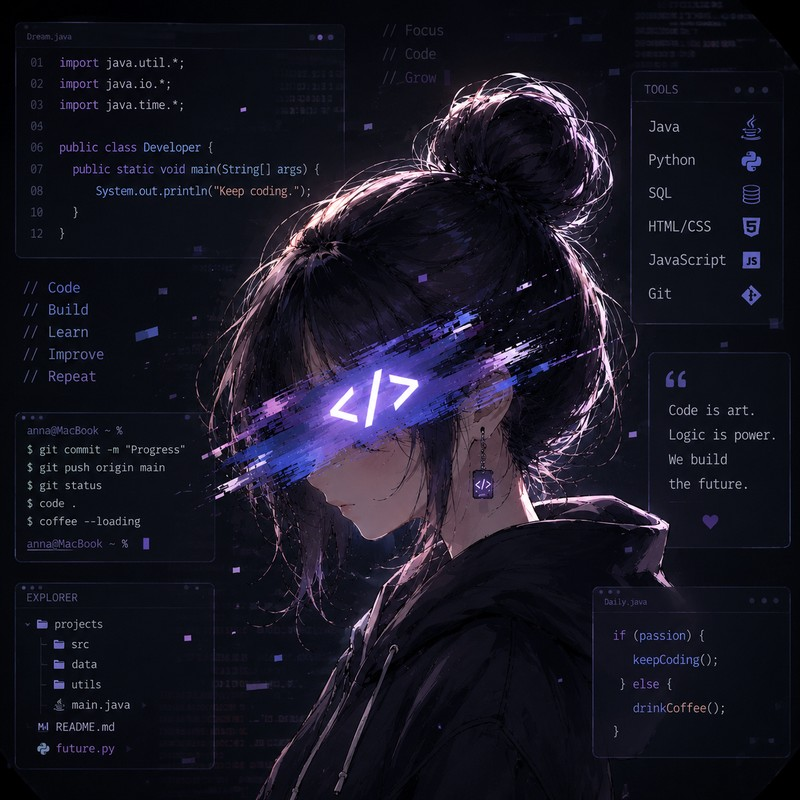

<table>
<tr>
<td width="60%" valign="top">

<h1>Hi there, I'm Anna 👋</h1>

🎓 Computer Science student at the University of Otago

<h3>About me</h3>

<ul>
<li>💻 Currently learning <strong>Java & Python</strong></li>
<li>🌱 Exploring <strong>GitHub, and programming fundamentals</strong></li>
<li>🚀 Future interests: <strong>Data Analytics · Full-Stack  · AI</strong></li>
<li>📚 Building university projects and personal coding projects</li>
</ul>

</td>
<td width="40%" align="center" valign="top">

</td>
</tr>
</table>

### Tech Stack

### GitHub Stats

